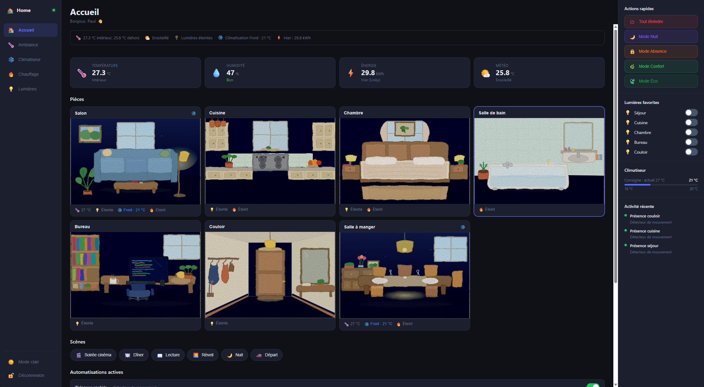

# Naive Home Dashboard

A clean, real-time replacement dashboard for Home Assistant — built with React, running in Docker.



## Features

- **Real-time** — WebSocket connection to HA, no polling
- **Room cards** with SVG illustrations that react to state (light on/off, heating, AC, day/night)
- **Screensaver** — photo frame with clock, indoor/outdoor temps, and ambient room photo after 30s idle
- **Smart summary bar** — animated icons (spinning fan, flickering flame, glowing bulb) reflecting actual state
- **Climate detail** — radiator modes (Hors-Gel / Éco / Confort / Boost) and AC modes with setpoint
- **Ambiance background** — real room photos with CSS weather filters and lamp halos
- **Dark/light theme** auto-detected from system preference
- **PWA** — installable on mobile and desktop
- **Secure** — HA token stays server-side, never exposed to the browser

## Architecture

```
HA instance  ←→  server (Node.js proxy)  ←→  client (React SPA)
              HA token auth, REST+WS          No direct HA access
```

Two Docker containers:
- **server** — proxies HA REST API and WebSocket, holds the HA token
- **client** — Vite + React SPA served by nginx

---

## Deploy with a Docker UI (Portainer, TrueNAS, Dockge, Yacht…)

No need to clone the repo. The images are published automatically on GitHub Container Registry at each release.

| Container | Image |
|-----------|-------|
| Server    | `ghcr.io/paullux/ha-dashboard/server:latest` |
| Client    | `ghcr.io/paullux/ha-dashboard/client:latest` |

### Environment variables

#### Server container

| Variable | Required | Description |
|----------|----------|-------------|
| `HA_URL` | ✅ | Your Home Assistant URL — e.g. `http://192.168.1.x:8123` |
| `HA_TOKEN` | ✅ | Long-lived access token from HA (Profile → Security → Long-lived access tokens) |
| `AUTH_PASSWORD_HASH` | ✅ | bcrypt hash of your dashboard password (see below) |
| `JWT_SECRET` | ✅ | A random string used to sign session tokens — e.g. `openssl rand -hex 32` |
| `PORT` | — | Server port, default `3001` |

#### Client container

| Variable | Required | Description |
|----------|----------|-------------|
| `VITE_API_URL` | ✅ | URL the browser uses to reach the server — e.g. `http://192.168.1.x:3001` |

### Ports to expose

| Container | Port | Usage |
|-----------|------|-------|
| server    | `3001` | REST API + WebSocket |
| client    | `5173` | Web UI (open this in your browser) |

### Generate a bcrypt password hash

Run this once on any machine that has Node.js:

```bash
node -e "const b=require('bcryptjs'); b.hash('yourpassword', 10).then(console.log)"
```

Or use an online bcrypt generator (e.g. bcrypt.online) — cost factor 10.

Paste the resulting `$2b$10$...` hash as the `AUTH_PASSWORD_HASH` value.

### Docker Compose (alternative)

If you prefer a `docker-compose.yml`:

```yaml
services:
  server:
    image: ghcr.io/paullux/ha-dashboard/server:latest
    restart: unless-stopped
    ports:
      - "3001:3001"
    environment:
      HA_URL: http://192.168.1.x:8123
      HA_TOKEN: your_long_lived_token
      AUTH_PASSWORD_HASH: "$2b$10$..."
      JWT_SECRET: your_random_secret

  client:
    image: ghcr.io/paullux/ha-dashboard/client:latest
    restart: unless-stopped
    ports:
      - "5173:80"
    environment:
      VITE_API_URL: http://192.168.1.x:3001
    depends_on:
      - server
```

---

## Build from source

### 1. Clone

```bash
git clone https://github.com/Paullux/ha-dashboard.git
cd ha-dashboard
```

### 2. Configure

Create a `.env` file at the root (never committed):

```env
HA_URL=http://192.168.1.x:8123
HA_TOKEN=your_long_lived_access_token
VITE_API_URL=http://your-server-ip:3001
AUTH_PASSWORD_HASH=your_bcrypt_hash
JWT_SECRET=your_random_secret
```

### 3. Start

```bash
docker compose up --build
```

Open `http://your-server-ip:5173` in your browser.

---

## Entity configuration

Edit [`client/src/config/dashboard.ts`](client/src/config/dashboard.ts) to map your HA entities to rooms and devices.

```ts
export const ROOMS: RoomConfig[] = [
  {
    id: "sejour",
    label: "Living room",
    tempEntity: "climate.ac_unit",
    lightEntity: "light.living_room",
    devices: [
      { label: "Lights",     entity: "light.living_room", type: "light" },
      { label: "AC",         entity: "climate.ac_unit",   type: "climate" },
    ],
  },
  // add as many rooms as you need
];
```

> **Note:** Customizing entities currently requires rebuilding the client image from source. A config-file approach (no rebuild needed) is planned.

---

## Custom Repository (HACS)

In HACS → ⋯ → Custom repositories, add:

```
https://github.com/Paullux/ha-dashboard
```

Category: **Integration**

> HACS won't auto-install this project (it's a Docker app, not a Python integration). Adding it as a custom repo gives you update notifications when new versions are released.

---

## Requirements

- Docker + Docker Compose
- Home Assistant 2024.1+
- A long-lived access token from HA

## Tech Stack

- **Client**: Vite, React, TypeScript
- **Server**: Node.js, Express, TypeScript
- **Realtime**: WebSocket (HA native protocol)
- **Auth**: JWT in HttpOnly cookie
- **Images**: GitHub Container Registry (ghcr.io), built by GitHub Actions on each tag

## License

MIT
